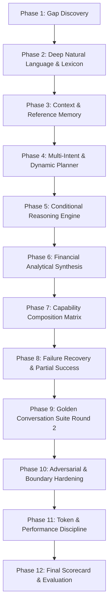

# 🔍 BÁO CÁO KHẢO SÁT: AI INTELLIGENCE GAPS DISCOVERY (ROUND 2)

**Ngày khảo sát**: 2026-09-20  
**Đối tượng khảo sát**: Hệ thống Khí Linh AI Agent (Parser, AgentCore, Tool Registry, RAG, Lifecycle, Frontend Contract)  
**Mục tiêu**: Nhận diện toàn diện các giới hạn suy luận sâu sau Round 1 để làm tiền đề phát triển Round 2 (Intelligence Evolution).

---

## I. Tổng Quan Đánh Giá Năng Lực Hiện Tại (Baseline Post-Round 1)

| Hạng mục năng lực | Trạng thái sau Round 1 | Đánh giá |
|---|---|---|
| **Đơn ý định (Single Intent)** | Hiểu tốt các câu lệnh trực diện (`create_expense`, `transfer_money`, `budget_status`...) | Đạt yêu cầu cơ bản |
| **Xưng hô & Nhân cách** | Gọi Đạo hiệu / "Ký Chủ", cấm "Đạo hữu", không tự đổi Đạo hiệu trong chat | Đạt 100% |
| **An toàn tài chính (Safety)** | Financial mutations yêu cầu xác nhận, idempotent, cấm đoán mò entity | Đạt chuẩn an toàn Level D |
| **Đa ý định (Multi-Intent)** | Chỉ có 1 nhánh hardcode đơn lẻ cho chi tiêu + ngân sách | **GAP LỚN** |
| **Lập kế hoạch đa bước (Multi-step Planning)** | Chỉ chạy 1 tool / 1 lượt tương tác, chưa có workflow phụ thuộc dữ liệu | **GAP LỚN** |
| **Suy luận điều kiện (Conditional Reasoning)** | Chưa phân biệt "Nếu... thì..." (Condition + Action vs Read-only) | **GAP LỚN** |
| **Bộ nhớ thực thể ngữ cảnh (Entity Reference Memory)**| Chỉ lưu tool cuối cùng (`_last_user_tool`), chưa nhớ thực thể ("nó", "cái ví đó") | **GAP TRUNG BÌNH** |
| **Sửa đổi hội thoại nâng cao (Conversation Correction)** | Đã hỗ trợ sửa số tiền/danh mục đơn giản, chưa hỗ trợ sửa hoán đổi nguồn/đích | **GAP TRUNG BÌNH** |
| **Suy luận thời gian tương đối (Temporal Reasoning)** | Mới hỗ trợ "hôm nay", "hôm qua", "tuần này", "tháng này", "tháng trước" | **GAP RÕ RÀNG** |
| **Suy luận số học tiếng Việt (Numeric Reasoning)** | Đã hỗ trợ nhiều định dạng, nhưng thiếu các biến thể như "1 củ 2", "2 củ rưỡi" | **GAP NHỎ** |
| **Phục hồi sự cố & Thành công một phần (Failure & Partial Success)** | Thất bại là dừng toàn bộ (`AgentState.ERROR`), chưa có cơ chế giải thích từng bước | **GAP TRUNG BÌNH** |
| **Phối hợp năng lực (Capability Composition)** | Các tool hoạt động độc lập, chưa phối hợp đa chiều (ví dụ: Ví x Danh mục x Thời gian) | **GAP LỚN** |

---

## II. Phân Tích Chi Tiết 17 Câu Hỏi Khoảng Trống (Gap Questions Audit)

### 1. AI có hiểu câu nói tự nhiên chưa?
- **Thực trạng**: Hệ thống hiện tại nhận diện rất tốt các câu có động từ chỉ hành động rõ ràng ("vừa ăn sáng 50k", "chuyển tiền", "tạo hạn mức").
- **Khoảng trống (Gap)**: Khi người dùng nói theo lối tự nhiên, bộc lộ trạng thái tài chính (ví dụ: *"nay ta lỡ tiêu hơi nhiều"*, *"tháng này mua sắm quá tay"*, *"còn bao nhiêu tiền để tiêu?"*), hệ thống chưa tự động chuyển đổi thành truy vấn phân tích (như `financial_overview`, `spending_by_category`, `budget_status`).

### 2. AI có hiểu cùng một ý bằng nhiều cách diễn đạt chưa?
- **Thực trạng**: RAG có khả năng matching tốt các câu hỏi tri thức, nhưng tầng Parser cho Tool Planning vẫn phụ thuộc vào tập từ khóa cốt lõi.
- **Khoảng trống (Gap)**: Cùng một ý "kiểm tra số dư tổng thể", các cách nói như *"ngân khố dạo này thế nào"*, *"tình hình tài chính ra sao"*, *"trong tay còn bao nhiêu linh thạch"* cần được ánh xạ đồng nhất về `financial_overview` mà không bị rơi vào `GENERAL_CONVERSATION`.

### 3. AI có hiểu câu cực ngắn chưa?
- **Thực trạng**: Các từ ngắn như "ok", "được", "hủy" đã được xử lý trong trạng thái `CONFIRMING`.
- **Khoảng trống (Gap)**: Khi người dùng nhập các câu cực ngắn ngoài trạng thái `CONFIRMING` (ví dụ: *"MoMo"*, *"1 triệu"*, *"tháng trước"*), hệ thống cần biết nhìn lại ngữ cảnh gần nhất để suy luận đó là câu trả lời bổ sung hay câu hỏi tiếp nối, thay vì trả lời đối thoại chung chung.

### 4. AI có hiểu reference tới hành động trước đó chưa?
- **Thực trạng**: Hệ thống lưu `_last_user_tool[user_id]` chứa `tool_name` và `args`.
- **Khoảng trống (Gap)**: Chưa có **Active Entity Memory**. Nếu lượt trước vừa hỏi *"Ví MoMo còn bao nhiêu?"*, lượt sau người dùng nói *"Kiểm tra nó"* hoặc *"Xem giao dịch của ví đó"*, AI chưa nhận diện được đại từ thay thế "nó", "ví đó" chính là `MoMo`.

### 5. AI có hiểu nhiều entity trong cùng câu chưa?
- **Thực trạng**: Đã giải quyết được `from_wallet` và `to_wallet` trong chuyển tiền.
- **Khoảng trống (Gap)**: Khi một câu chứa đồng thời 3-4 thực thể khác loại (ví dụ: *"Kiểm tra chi tiêu Ăn Uống (Category) qua ví Vietcombank (Wallet) trong tháng trước (Period)"*), hệ thống chưa thể kết hợp đồng thời cả 3 bộ lọc này vào một công cụ tìm kiếm/phân tích.

### 6. AI có tự xây dựng multi-step plan chưa?
- **Thực trạng**: Chỉ có hàm `_is_multi_tool_read_query` hardcode riêng cho cặp `financial_overview` + `budget_status`.
- **Khoảng trống (Gap)**: Chưa có **Dynamic Multi-Step Planner**. AI cần khả năng tự sinh kế hoạch gồm danh sách các bước: `[Step 1: read_debts] -> [Step 2: filter_due_date] -> [Step 3: synthesize]`.

### 7. AI có biết thứ tự tool execution chưa?
- **Thực trạng**: Các tool thực thi tuần tự hoặc độc lập.
- **Khoảng trống (Gap)**: Chưa có cơ chế **Data Dependency Chain** (kết quả của Tool A là đầu vào của Tool B). Ví dụ: Tool `get_wallets` tìm ví có số dư lớn nhất -> lấy ID ví đó làm tham số cho `search_transactions`.

### 8. AI có biết khi nào cần hỏi user và khi nào có thể tự suy luận chưa?
- **Thực trạng**: Đã có suy luận ví còn lại khi chỉ có 2 ví trong hệ thống.
- **Khoảng trống (Gap)**: Chưa mở rộng cho các thực thể khác: Nếu người dùng chỉ có 1 khoản nợ duy nhất và nói *"trả nợ"*, AI có thể tự trích xuất khoản nợ đó; nếu có nhiều hơn 1 thì mới hỏi làm rõ.

### 9. AI có biết khi nào một yêu cầu chứa nhiều intent chưa?
- **Thực trạng**: Câu ghép có "và" thường bị xử lý theo intent đầu tiên hoặc theo thứ tự regex ưu tiên.
- **Khoảng trống (Gap)**: Thiếu **Compound Intent Classifier** để nhận biết: Câu nói chứa 2 mệnh đề độc lập (ví dụ: *"Xem tháng này tiêu bao nhiêu và nợ còn bao nhiêu"* -> cần gọi cả analytics chi tiêu lẫn sổ nợ).

### 10. AI có biết tách nhiều intent chưa?
- **Thực trạng**: Chưa có module tách câu phức thành các sub-task.
- **Khoảng trống (Gap)**: Cần bổ sung `IntentDecomposer` để phân rã câu ghép thành mảng các atomic requests.

### 11. AI có biết gộp các bước thành một workflow chưa?
- **Thực trạng**: Chưa có cấu trúc `CompositeWorkflow`.
- **Khoảng trống (Gap)**: Cần tạo cấu trúc điều phối workflow (DAG hoặc Sequential Pipeline) cho phép thực thi, thu thập kết quả trung gian và chuyển cho bước tiếp theo.

### 12. AI có biết phục hồi khi một tool thất bại chưa?
- **Thực trạng**: Khi một tool trả về `success=False`, AgentCore lập tức trả về `AgentState.ERROR`.
- **Khoảng trống (Gap)**: Thiếu **Fallback & Recovery Strategy**. Nếu một công cụ đọc chi tiết bị lỗi, AI có thể thử công cụ tổng quan thay thế hoặc giải thích nguyên nhân và đưa ra hướng dẫn thay vì chỉ báo lỗi thô.

### 13. AI có biết giải thích partial failure chưa?
- **Thực trạng**: Phản hồi chỉ là nhị phân (SUCCESS hoặc ERROR).
- **Khoảng trống (Gap)**: Trong workflow đa bước, nếu bước 1 thành công (đã tra cứu số dư) nhưng bước 2 thất bại (không tìm thấy giao dịch), AI phải báo rõ: *"Đã kiểm tra số dư thành công (2,000,000đ), nhưng không thể truy xuất lịch sử giao dịch do..."*.

### 14. AI có hiểu thời gian tương đối chưa?
- **Thực trạng**: `parse_period` chỉ hỗ trợ: today, yesterday, this_week, this_month, last_month, YYYY-MM.
- **Khoảng trống (Gap)**: Thiếu các khoảng thời gian phổ biến trong đời sống:
  - *"tuần trước"*, *"tuần vừa rồi"* (`last_week`)
  - *"đầu tháng"*, *"từ đầu tháng đến giờ"* (`month_to_date`)
  - *"cuối tháng"* (`month_end`)
  - *"7 ngày qua"*, *"7 ngày gần đây"* (`last_7_days`)
  - *"30 ngày qua"*, *"30 ngày gần đây"* (`last_30_days`)
  - *"3 tháng gần đây"* (`last_3_months`)
  - *"quý này"*, *"quý trước"* (`this_quarter`, `last_quarter`)
  - *"năm nay"*, *"năm ngoái"* (`this_year`, `last_year`)

### 15. AI có hiểu số tiền tự nhiên tiếng Việt chưa?
- **Thực trạng**: `parse_amount` đã hỗ trợ k, triệu, tỷ, lít, lốp, phân cách hàng nghìn.
- **Khoảng trống (Gap)**: Còn sót:
  - *"1 củ 2"*, *"2 củ rưỡi"* (chưa kết hợp `củ` với số thập phân/rưỡi tương tự `triệu`)
  - *"1 tỷ rưỡi"*, *"nửa tỷ"*
  - *"50 ngàn"* trong câu có dấu câu phức tạp
  - Tiếng lóng *"1 vé"*, *"nửa lít"*

### 16. AI có hiểu synonym và cách nói đời thường chưa?
- **Thực trạng**: Từ điển từ đồng nghĩa hiện tại nằm rải rác trong từng hàm regex.
- **Khoảng trống (Gap)**: Thiếu **Centralized Synonym Registry** chuẩn hóa:
  - Tiêu tiền: "xài", "chi", "đốt tiền", "hết", "thanh toán", "cà thẻ", "ting ting"
  - Tiền về: "lĩnh", "nhận", "ting ting", "thóc về", "lúa về"
  - Nợ nần: "báo nợ", "vay", "mượn", "cắm", "trả bớt", "tất toán"

### 17. AI có hiểu xianxia terminology mà không làm mất nghĩa tài chính chưa?
- **Thực trạng**: Khí Linh đã giữ vững phong cách tu tiên cổ phong, nhưng tầng dịch thuật ngữ (Xianxia Semantic Layer) chưa bao quát hết:
  - "Linh thạch" -> Tiền / Số dư
  - "Ngân khố / Khố phòng" -> Tổng tài sản / Số dư các ví
  - "Túi Càn Khôn" -> Ví tiền
  - "Tán tài" -> Chi tiêu
  - "Nạp tài / Thu hoạch linh dược" -> Thu nhập
  - "Khẩu phần / Đan dược định kỳ" -> Hạn mức chi tiêu / Chi phí định kỳ
  - "Nhân quả trái chủ" -> Sổ nợ
  - "Tụ Linh Trận" -> Mục tiêu tiết kiệm

---

## III. Ma Trận Kế Hoạch Hiện Thực Hóa (Evolution Roadmap)

---

## IV. Kết Luận Khảo Sát
Hệ thống hiện tại đã sở hữu nền móng cực kỳ vững chắc về an toàn giao dịch, kiểm soát quyền hạn và xử lý single-intent. Việc nâng cấp lên **Intelligence Evolution Round 2** sẽ tập trung chuyển biến từ **"Xử lý câu lệnh" (Command Handling)** sang **"Suy luận tổng thể và phối hợp năng lực" (Analytical & Composable Intelligence)**.
